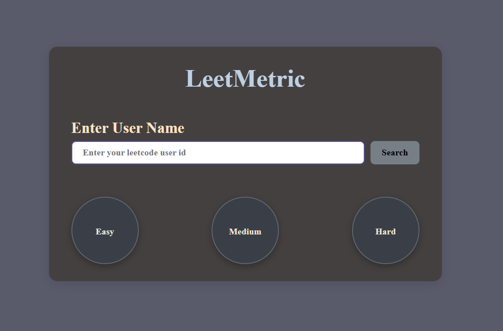

 LeetMetric 🧠📊

LeetMetric is a web application that tracks and displays your LeetCode problem-solving stats using dynamic circular progress bars.

## 🔥 Features
- 🔍 Enter your LeetCode username to fetch stats
- 🟢 Easy / 🟡 Medium / 🔴 Hard problem breakdown
- ⭕ Circular visual progress bars
- ⏳ Simple animated loading spinner while fetching data
- 📊 Leaderboard (coming soon)

## 📦 Tech Stack
- HTML
- CSS
- JavaScript
- LeetCode Unofficial API

## 📺 Live Demo
👉 [LeetMetric GitHub Page]( https://hemlata559.github.io/leetcodeMatrix/)

## 🛠️ Setup
1. Clone this repository
2. Open `index.html` in your browser
3. No backend required

## 🙋‍♀️ Future Improvements
- Leaderboard with real-time ranking
- User avatar and profile stats
- Dark/light theme toggle

## 📸 Preview Images

"This project uses data from the public LeetCode Stats API. All rights to the API belong to their respective owners."

## 👩‍💻 Author
Hemlata yadav ([@Hemlata559](https://github.com/Hemlata559))
